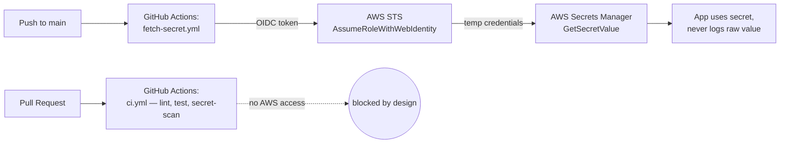

# Secure AWS Secrets in a GitHub Actions CI/CD Pipeline

A reference implementation of a production-grade pattern: a GitHub Actions
pipeline that securely reads a secret from **AWS Secrets Manager** using
**OIDC federation** — no long-lived AWS access keys stored in GitHub, ever.

## Why this exists

This is a learning project built to demonstrate the current best-practice
way to connect GitHub Actions to AWS: short-lived, tightly-scoped credentials
obtained via OpenID Connect, instead of a static IAM access key pasted into
a repo secret. Every AWS resource is created **manually in the AWS Console**
(no Terraform) and documented step by step, so you can follow along and
understand exactly what's being created and why — not just run a script.

## Architecture at a glance



Full details in [`docs/01-architecture.md`](docs/01-architecture.md).

## Repo layout

```
secrets_cicd/
├── docs/                       # Step-by-step setup guide — start here
├── app/                        # Minimal Python demo app + tests
└── .github/workflows/          # ci.yml (safe, no AWS) + fetch-secret.yml (OIDC → AWS)
```

## Setup — follow in order

1. [`docs/01-architecture.md`](docs/01-architecture.md) — how OIDC federation works and why
2. [`docs/02-aws-console-setup.md`](docs/02-aws-console-setup.md) — create the OIDC provider, IAM role, and secret in AWS
3. [`docs/03-github-setup.md`](docs/03-github-setup.md) — wire it up in GitHub (variables, Environments, branch protection)
4. [`docs/04-security-best-practices.md`](docs/04-security-best-practices.md) — why each choice was made, and what a real production setup adds
5. [`docs/05-troubleshooting.md`](docs/05-troubleshooting.md) — common errors and fixes

## Security highlights

- ✅ Zero long-lived AWS credentials — GitHub OIDC → AWS STS → temporary credentials (~1hr TTL)
- ✅ IAM trust policy scoped to one exact repo + branch
- ✅ IAM permission policy scoped to one action (`GetSecretValue`) on one secret ARN
- ✅ Secret value never printed or logged — the app masks it before any output
- ✅ AWS-touching workflow is fully separate from the PR-facing CI workflow, so forked PRs can never reach AWS
- ✅ Manual-approval Environment gate + branch protection + dual-layer secret scanning (gitleaks + GitHub push protection)

See [`docs/04-security-best-practices.md`](docs/04-security-best-practices.md) for the full rationale.

## Running the app locally / tests

```bash
cd app
pip install -r requirements-dev.txt
pytest tests/ -v          # runs against a mocked AWS (moto) — no real credentials needed

# To actually fetch the real secret locally, you need real AWS credentials
# configured (e.g. via `aws configure` or SSO) — this bypasses OIDC and is
# for local debugging only, never for CI:
cp ../.env.example .env   # edit values as needed, then export them
python fetch_secret.py
```
