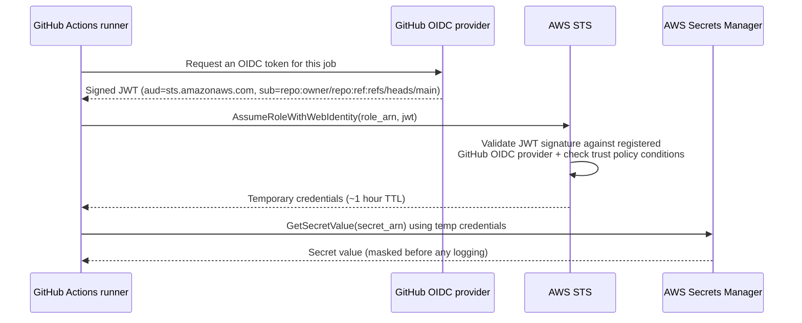

# Architecture

## Goal

GitHub Actions needs to read one secret from AWS Secrets Manager during a
pipeline run, without ever storing a long-lived AWS credential in GitHub.

## Why not just use an IAM user's access key?

The obvious approach — create an IAM user, generate an access key, paste it
into a GitHub Actions secret — works, but that access key:

- never expires on its own, so if it leaks it's valid forever until someone
  manually rotates it
- is usable from anywhere, not just from your GitHub Actions runs
- has to be manually rotated, and every rotation is a manual, error-prone step

**OIDC federation** removes the credential entirely. GitHub issues a
short-lived, cryptographically signed identity token for each workflow run.
AWS trusts that token (because you registered GitHub as an OIDC identity
provider) and exchanges it for temporary AWS credentials that expire in
about an hour. Nothing long-lived is ever stored anywhere.

## Trust flow

## Components

| Component | Purpose |
|---|---|
| **GitHub OIDC provider** (in AWS IAM) | Tells AWS to trust tokens signed by `token.actions.githubusercontent.com`. Created once per AWS account. |
| **IAM role** | The identity the workflow assumes. Its *trust policy* restricts which repo/branch can assume it; its *permission policy* restricts what it can do once assumed. |
| **IAM permission policy** | Scoped to exactly `secretsmanager:GetSecretValue` on exactly one secret ARN — nothing else. |
| **AWS Secrets Manager secret** | Holds the actual secret value, encrypted at rest with a KMS key. |
| **`fetch-secret.yml` workflow** | Requests the OIDC token, assumes the role, fetches the secret, runs the demo app. Gated by a GitHub Environment requiring manual approval. |
| **`ci.yml` workflow** | Runs on every PR. No AWS access at all — just lint, unit tests (against a *mocked* Secrets Manager via `moto`), and a secret-scanning check on the diff. |

## Two-workflow split, on purpose

Splitting "safe CI that runs on untrusted PRs" from "the one workflow that
touches real AWS" is itself a security control: a pull request from a fork
can trigger `ci.yml`, but `ci.yml` has no `id-token: write` permission and no
AWS role to assume, so there's nothing for a malicious PR to exploit. Only
pushes to `main` (or a manually approved `workflow_dispatch`) can trigger
`fetch-secret.yml`.

## Next

Set this up for real in [`02-aws-console-setup.md`](02-aws-console-setup.md).
